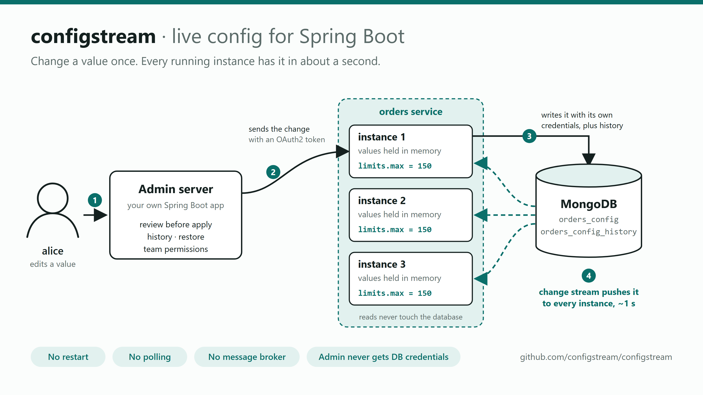
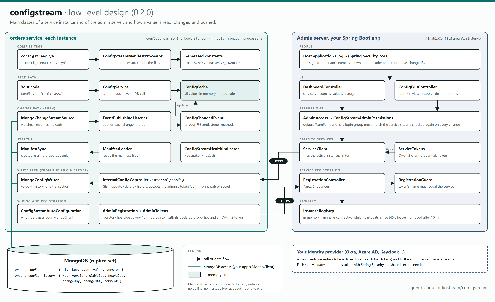

# configstream

[](https://github.com/configstream/configstream/actions/workflows/ci.yml)
[](https://central.sonatype.com/artifact/io.github.configstream/configstream-spring-boot-starter)
[](https://www.apache.org/licenses/LICENSE-2.0)

> Push-based, restart-free feature flags and configuration for Spring Boot — using the database you already run.

**Status:** 0.2.1. Tested and usable, but its APIs and settings may still change
before 1.0; read the release notes when upgrading.

## What it does

`configstream` keeps feature flags and non-secret properties in a database collection/table, loads them into an
in-memory cache at startup, and updates that cache **instantly across every running instance** when a value changes —
using the database's native change notifications (MongoDB Change Streams; PostgreSQL `LISTEN/NOTIFY` planned).
No restarts, no polling, no message broker, no new infrastructure.

## Who it's for

Java / Spring Boot teams already running **MongoDB** (PostgreSQL support planned) who want fast, self-hosted flag and
config propagation without operating a separate config server.

**Not for:** secrets/credentials (use Vault or your cloud secrets manager), or teams needing percentage rollouts /
A/B experimentation (see Unleash or LaunchDarkly).

## Try it in two minutes

With only Docker installed, start MongoDB, the admin server and two instances of a sample `orders` service:

```bash
git clone https://github.com/configstream/configstream.git
cd configstream
docker compose -f quickstart/compose.yml up --build
```

The first start builds the sample apps, which takes a few minutes. Then:

1. Open http://localhost:8081/demo and http://localhost:8082/demo: two instances showing the same live values.
2. Open the admin server at http://localhost:8090 and sign in as `alice` / `alice-local`.
3. Open **orders**, edit `limits.max`, review and apply.
4. Refresh both `/demo` pages: each instance shows the new value within about a second, without a restart.

The [walkthrough](docs/walkthrough.md) shows each of these steps with screenshots.

Stop with Ctrl+C, and remove everything with `docker compose -f quickstart/compose.yml down -v`. The passwords and
secrets in the quick start are public, for trying configstream locally only.

## Quick start

Requirements: Java 17+, Spring Boot 3.x or 4.x, and a MongoDB **replica set** (MongoDB Atlas always is one; for a
local single-node replica set, `docker compose up -d` in this repository).

**1. Add the starter and the annotation processor**

```xml
<dependency>
    <groupId>io.github.configstream</groupId>
    <artifactId>configstream-spring-boot-starter</artifactId>
    <version>0.2.1</version>
</dependency>
```

plus `configstream-processor` 0.2.1 as an annotation processor (see
[Read them through generated constants](#read-them-through-generated-constants)).

**2. Declare your properties** in `src/main/resources/configstream.yml`:

```yaml
properties:
  - key: feature.funds.enabled
    type: boolean
    initialValue: false
```

**3. Read them**, with `@ConfigStreamManifest` on your application class:

```java
boolean enabled = config.get(Feature.FUNDS_ENABLED);   // ConfigService config, injected
```

On startup the property is created in your MongoDB. Change it in the [admin server](#admin-server) (or directly in
the database) and every running instance sees the new value within about a second, without a restart.

## How it works



Each service keeps its properties in its own MongoDB collection and holds them in memory. When a value changes, MongoDB
pushes the change to every instance through a change stream, so reads never touch the database and every instance
updates within about a second. The admin server is optional: it lists services, shows values and history, and sends
changes to a service, which writes them with its own database credentials.

### Low-level design

The main classes of a service instance and of the admin server: how a value is read (from memory), changed (through
one instance, in a transaction with its history) and pushed (change stream), and how the two sides authenticate each
other with tokens.

[](docs/diagrams/low-level-design.png)

Both diagrams are drawn from the HTML files next to them in [`docs/diagrams`](docs/diagrams); edit those and re-export
the PNGs when the design changes.

## Modules

| Module | Purpose |
|---|---|
| `configstream-api` | Storage-agnostic contracts, property types, the manifest, in-memory cache |
| `configstream-processor` | **Build time**: generates typed property constants from `configstream.yml` and checks it |
| `configstream-mongo` | MongoDB Change Streams backend |
| `configstream-spring-boot-starter` | **Client**: add to each service. `ConfigService` bean, `ConfigChangedEvent`, internal endpoints, registration with the admin server |
| `configstream-admin-spring-boot-starter` | **Server**: add to one Spring Boot app, plus `@EnableConfigStreamAdminServer`. Service registry + dashboard |

Like Eureka, there is a client starter and a server starter. Every service adds the client; one app, deployed once,
adds the server. Config changes do not travel through the admin server: it asks a service to write the change, and
MongoDB change streams push it to every instance.

## Usage (Spring Boot)

configstream is for Spring Boot services that already use MongoDB. Add `configstream-spring-boot-starter` to your
dependencies; it uses your application's own MongoDB connection (its `MongoClient`, e.g. from
`spring-boot-starter-data-mongodb`) and opens none of its own. The MongoDB must be a replica set (Atlas always is),
because changes arrive through change streams.

```yaml
spring:
  application:
    name: orders              # configstream's collections: orders_config and orders_config_history
  data:
    mongodb:                  # Spring Boot 3; on Spring Boot 4: spring.mongodb.uri
      uri: mongodb://localhost:27017/orders?replicaSet=rs0&socketTimeoutMS=30000

configstream:
  mongo:
    # database: orders                       # optional, defaults to your application's database
    # config-collection: orders_settings     # optional, defaults to <spring.application.name>_config
    # history-collection: orders_audit       # optional, defaults to <config-collection>_history
```

Each service uses its own collections, named after the service, so several services can safely share one database.
Keep them in the database your service already uses: the load then spreads over your teams' clusters. Each instance
adds one change stream and borrows one connection from your pool for it.

Both collections are created automatically on the first start; the service's database user needs read and write
access (MongoDB's `readWrite` role).

**Spring Boot 4:** the same starters work unchanged. Boot 4 renamed the MongoDB settings, so set `spring.mongodb.uri`
(and `spring.mongodb.database`) instead of `spring.data.mongodb.*`; configstream reads whichever your Boot version uses.
Boot 4 also creates the `MongoClient` only with `spring-boot-starter-data-mongodb` (or `spring-boot-starter-mongodb`),
so add one if your service doesn't have it yet. The `compat/spring-boot-4` module tests a service and an admin server
on Spring Boot 4 end to end.

### Declare properties in `configstream.yml`

Every property is declared in `src/main/resources/configstream.yml`, with a type (`boolean`, `int`, `decimal` or
`string`) and an initial value:

```yaml
properties:
  - key: feature.funds.enabled
    type: boolean
    initialValue: false
    description: Show the funds page   # optional
  - key: feature.funds.limit
    type: int
    initialValue: 3
```

- **The manifest is the only way to add properties.** On startup, each declared property that is missing from
  MongoDB is created with its initial value, so a first deploy to a new environment finds everything it needs.
  Existing values are never changed: the initial value only matters the first time.
- **The stored value always wins.** The initial value is used only while a property is missing from MongoDB or its
  stored value doesn't fit its type.
- **Types never change.** Starting a version that declares an existing key with a different type fails with an
  explanation. To change a type, declare the property under a new key.
- **Per-environment initial values:** `configstream-prod.yml` next to the manifest can give declared properties a
  different initial value in prod (`properties: { feature.funds.limit: 10 }`). It is used when
  `configstream.environment=prod`, e.g. set in `application-prod.yml`. Environment files can't declare new keys.

### Read them through generated constants

Typed constants are generated from the manifest at compile time, so a misspelled key or a value read as the wrong
type doesn't compile. Add the annotation processor to the build:

```xml
<!-- Maven: maven-compiler-plugin -->
<configuration>
    <annotationProcessorPaths>
        <path>
            <groupId>io.github.configstream</groupId>
            <artifactId>configstream-processor</artifactId>
            <version>${configstream.version}</version>
        </path>
    </annotationProcessorPaths>
</configuration>
```

```kotlin
// Gradle
annotationProcessor("io.github.configstream:configstream-processor:$configstreamVersion")
```

and put `@ConfigStreamManifest` on any one class, typically the application class:

```java
@SpringBootApplication
@ConfigStreamManifest   // packageName = "..." to generate elsewhere; default: this class's package
public class OrdersApplication { ... }
```

Each key's first part becomes a class and the rest a constant: `feature.funds.limit` gives `Feature.FUNDS_LIMIT`, a
`Property<Integer>`. The build fails, naming the file and property, if the manifest or any `configstream-<env>.yml`
next to it is invalid, or if two keys would generate the same name. After editing only `configstream.yml`, rebuild
(e.g. `mvn clean compile`, or Rebuild in the IDE): incremental compiles only notice changed `.java` files.

```java
@Service
class Checkout {
    private final ConfigService config;

    Checkout(ConfigService config) { this.config = config; }

    void run() {
        int limit = config.get(Feature.FUNDS_LIMIT);
    }

    @EventListener
    void onChange(ConfigChangedEvent e) {
        // e.isFor(Feature.FUNDS_LIMIT), e.oldValue(), e.newValue(); fired within ~1s of the change in Mongo
    }
}
```

Stored as one document per property: `{ "_id": "feature.funds.limit", "type": "int", "value": 3, "version": 1 }`.
configstream shares your application's `MongoClient` and doesn't change its settings.

### Connecting to the admin server (optional)

```yaml
spring.application.name: orders
configstream:
  team: team-a
  internal:
    secret: ${CONFIGSTREAM_SECRET}      # at least 16 chars; e.g. `openssl rand -hex 32`
  admin:
    url: https://configstream-admin.internal
    heartbeat-interval: 15s            # default
```

- **`internal.secret`** enables the internal endpoints, through which the admin app changes config using *this
  service's* database credentials. Callers must send the secret in the `X-ConfigStream-Secret` header. Instead of
  (or as well as) a secret, the admin server can call with a token: see
  [Securing calls to services](#securing-calls-to-services). Without either the endpoints do not exist. Serve them
  over HTTPS only.
  - `POST /internal/config/update` with `{"key": "...", "value": "...", "type": "int", "changedBy": "alice",
    "comment": "optional"}` (`type` optional) sets an existing property and returns the recorded history entry (200),
    or 204 if the value was already set. It never creates a property (404), and rejects a value that doesn't fit the
    property's type or a different `type` (400). Rejections carry `{"error": "..."}`, a message for the person.
  - `POST /internal/config/delete` with `{"key": "...", "changedBy": "alice", "comment": "optional"}` deletes an
    orphan (a property this instance doesn't declare) and returns the recorded history entry (200), or 204 if it
    doesn't exist. Properties this instance declares can't be deleted (409).
  - `GET /internal/config/history?key=...&limit=50` returns that property's changes, newest first.
  - `GET /internal/config` returns every property as this instance currently sees it:
    `{"feature.funds.limit": {"type": "int", "value": "3"}}`.
- **`admin.url`** makes the instance register with the admin app on startup, send heartbeats, and deregister on
  shutdown. If the admin app is down or unreachable the service still starts and keeps retrying in the background.
- **History:** every change made through configstream is appended to the history collection (`orders_config_history`
  for `orders`: key, version, old and new value, who, when, comment) in the same transaction as the change itself, starting with v1 "Created from
  configstream.yml". To **roll back**, write the old value again, e.g. with `"comment": "Reverted to v3"`; history is
  never rewritten. Changes made directly in the database still reach every cache but are not recorded.
- **Deletes** remove the property but keep its history. If a version of the service that declares it starts again
  (for example after a rollback), the property is created again with that version's initial value and its versions
  continue; restore its old value from the history.
- **Blue-green and rolling deploys:** give every version the same `spring.application.name`, and let every instance
  register with the admin server, so properties still used by the old version aren't shown as orphans.
- If your app uses **Spring Security** with the shared secret, permit `/internal/config/**` and exclude it from CSRF
  protection; the secret is what authenticates these calls.

### When the connection to MongoDB fails

Each instance keeps its last known values while cut off, then reconnects and catches up on every change it missed
(or reloads everything if it was away too long).

- **Dead connections are noticed if your client has a socket timeout.** Set `socketTimeoutMS` (e.g. `30000`) on your
  MongoDB URI: a connection dropped silently by a firewall then fails and is reopened. Without it, the MongoDB driver
  waits indefinitely, and the instance may miss changes for a long time. configstream logs a warning at startup when
  the MongoDB URI (`spring.data.mongodb.uri`, or `spring.mongodb.uri` on Spring Boot 4) has no `socketTimeoutMS`.
- **The watcher can't die silently.** If it stops on an unexpected error, it restarts and reloads all values.
- **Health check.** With Spring Boot Actuator, `/actuator/health` has a `configstream` entry: UP while connected, still
  UP while reconnecting after a short interruption, and DOWN once cut off longer than `configstream.health.down-after`
  (default `2m`), with the last error. Use it for alerts or readiness, not for a liveness check that restarts the app:
  if MongoDB is down, restarting every instance doesn't help. Turn it off with
  `management.health.configstream.enabled=false`.

## Admin server

The admin server is the app services register with (`configstream.admin.url`). It shows every registered service, its
active instances (those sending heartbeats), each property with its type, value and description, and each property's
change history. Deploy one per environment.

It **edits values only**. Properties are added, renamed and retyped in each service's `configstream.yml`, so there is
no Add button, and inputs match the type (true/false buttons for a boolean, a number field for an int). Instances tell
the admin server which properties their manifest declares when they register; a stored property that no active
instance declares is marked **Orphan**, and only orphans can be deleted.

Turn any Spring Boot web app into the admin server, the way `@EnableEurekaServer` does:

```xml
<dependency>
    <groupId>io.github.configstream</groupId>
    <artifactId>configstream-admin-spring-boot-starter</artifactId>
    <version>0.2.1</version>
</dependency>
```

```java
@SpringBootApplication
@EnableConfigStreamAdminServer
public class ConfigStreamAdminApp {
    public static void main(String[] args) {
        SpringApplication.run(ConfigStreamAdminApp.class, args);
    }
}
```

The dependency alone activates nothing; the annotation does. There is no separate admin jar to download: the admin
server is always your own Spring Boot app, deployed and configured like any other.

Every change takes two steps: an edit is checked against the property's type and reviewed against the current value
before it is applied, and a delete is confirmed on its own page, which warns that rolling back to a version declaring
the property creates it again with that version's initial value. The admin app never touches a service's database.
It sends the change to any healthy
instance of the service, which writes it with its own credentials, and every instance picks it up within about a
second. Failures (no instance reachable, secret or token rejected, request invalid) are shown on the page. If an instance
received the change but did not confirm it (a timeout or server error), the admin app does not retry on another
instance. It tells you to check the key's history first, because the change may already have been applied.

```yaml
configstream:
  admin-server:
    service-secrets:
      orders: ${ORDERS_CONFIG_SECRET}   # must match that service's configstream.internal.secret
    # default-service-secret: ...       # for services not listed above
    lease-duration: 45s                 # shown as down after this long without a heartbeat
    evict-after: 10m                    # removed from the registry after this long
    dashboard:
      path: /                           # e.g. /admin if the app has pages of its own

server.servlet.session.tracking-modes: cookie   # recommended: keeps session ids out of URLs
```

The registration API is always at `/api/instances`, whatever the dashboard path. The dashboard's templates and CSS
live under `configstream-admin/`, so they do not clash with the host app's own.

### Securing registration

Services prove who they are with tokens from your identity provider (Okta, Azure AD, Keycloak and so on), using the
standard OAuth2 client-credentials flow. The admin server never stores service passwords.

**On each service** (with `spring-boot-starter-oauth2-client`):

```yaml
spring:
  security:
    oauth2:
      client:
        registration:
          configstream:
            client-id: orders
            client-secret: ${ORDERS_CLIENT_SECRET}
            authorization-grant-type: client_credentials
        provider:
          configstream:
            token-uri: https://login.example.com/oauth2/token
configstream:
  admin:
    oauth2-client: configstream     # send these tokens to the admin server
```

Tokens are fetched once, cached and renewed before they expire, so heartbeats don't call your identity provider.

**On the admin server**, your application validates the tokens, for example with
`spring-boot-starter-oauth2-resource-server` protecting `/api/instances/**`. configstream then checks that the token
belongs to the service it acts for: the token's identity (its principal name, the `sub` claim by default) must equal
the service's `spring.application.name`, so a token for `orders` can't register, heartbeat or remove `payments`
(403). If your provider puts the service name in another claim, set
`spring.security.oauth2.resourceserver.jwt.principal-claim-name`.

**Without tokens**, the admin server accepts registrations only from its own machine ("local mode"), so trying
configstream on a laptop needs no setup, and a forgotten setting never leaves a real server open. To accept anyone on
a network you fully trust, set `configstream.admin-server.allow-unauthenticated-registration: true`.

### Securing calls to services

The admin server reads and changes a service's config by calling that service's `/internal/config` endpoints. It can
prove who it is with a shared secret per service (`service-secrets` above) or, without any shared secret, with its own
token from your identity provider, the same client-credentials flow services use to register.

**On the admin server** (with `spring-boot-starter-oauth2-client`):

```yaml
spring:
  security:
    oauth2:
      client:
        registration:
          configstream:
            client-id: configstream-admin
            client-secret: ${ADMIN_CLIENT_SECRET}
            authorization-grant-type: client_credentials
        provider:
          configstream:
            token-uri: https://login.example.com/oauth2/token
configstream:
  admin-server:
    oauth2-client: configstream     # call services with these tokens; service-secrets become optional
```

One token is fetched, cached and renewed for calls to every service.

**On each service**, your application validates the token, for example with `spring-boot-starter-oauth2-resource-server`
requiring authentication on `/internal/config/**`, and configstream accepts only the admin server's identity:

```yaml
configstream:
  internal:
    admin-principal: configstream-admin   # the token's principal name (the `sub` claim by default)
```

Callers authenticated as anyone else get 403, and a person signed in to your app can't call these endpoints. If your
provider puts the client ID in another claim, set `spring.security.oauth2.resourceserver.jwt.principal-claim-name`.
`internal.secret` keeps working alongside `admin-principal`, so you can switch services over one at a time.

### Signing in people

Login for people is up to the application hosting the admin server, typically Spring Security with your company's
identity provider. Once someone is signed in, the admin server shows their name in the header and records every
change under it: the "Your name" field disappears, and a submitted name is ignored, so the history can be trusted. Set
`configstream.admin-server.dashboard.logout-path` (e.g. `/logout`) to add a "Sign out" button, which posts there.
Without a login, the header says "No login: trusted networks only".

The name shown and recorded is the login's principal name. With single sign-on (OpenID Connect), Spring Security uses
the `sub` claim by default, which is often an unreadable ID; pick a readable claim instead:

```yaml
spring.security.oauth2.client.provider.<your-provider>.user-name-attribute: preferred_username   # or email
```

With Spring Security, permit `/api/instances/**` (services authenticate there with tokens, not a login) and exclude it
from CSRF protection; the dashboard's forms already carry the CSRF token. `samples/demo-admin` shows a minimal setup.

### Who can see and change which service

By default, a signed-in person sees and changes the services whose team (`configstream.team` on the service) is one
of their login groups. Groups are the person's roles or Spring Security authorities (`team-a` or `ROLE_team-a`); map
your identity provider's groups to them in the host application. Admin groups see and change everything:

```yaml
configstream:
  admin-server:
    admin-groups: config-admins
```

A service someone may not see is left off the dashboard, and opening it by address answers "not registered". Every
change is checked again on the server, not just by hiding buttons. A service without a team is only open to admin
groups. For other rules, such as testers who may look but not change, define a `ConfigStreamAdminPermissions` bean:

```java
@Bean
ConfigStreamAdminPermissions permissions() {
    TeamPermissions teams = new TeamPermissions(List.of("config-admins"));
    return new ConfigStreamAdminPermissions() {
        public boolean canView(AdminUser user, ServiceSummary service) {
            return teams.canView(user, service) || user.isInGroup("testers");
        }
        public boolean canEdit(AdminUser user, ServiceSummary service) {
            return teams.canEdit(user, service);
        }
    };
}
```

> **Without a login**, anyone who can open the admin app can edit any registered service, "changed by" is whatever
> they type, and the header warns "No login: trusted networks only". Run it that way only on a trusted network.

## Local development

Requirements: JDK 17+, Maven 3.9+, Docker.

```bash
docker compose up -d        # local single-node Mongo replica set
mvn verify                  # build + unit + integration tests, on Spring Boot 3 and (compat/spring-boot-4) Boot 4
```

Integration tests start MongoDB in Docker. Without Docker, point them at any replica set, such as a free Atlas cluster:
set `CONFIGSTREAM_TEST_MONGO_URI` to its connection string, and each run uses its own `cstest_*` database, dropped
afterwards.

`samples/` holds two runnable apps for trying it by hand (not published): `demo-admin`, an admin server on port 8090,
and `demo-service`, an `orders` service on port 8081 whose `GET /demo` shows live values. To use a MongoDB other than
`localhost:27017` (e.g. Atlas), set the `CONFIGSTREAM_MONGO_URI` environment variable. `demo-admin` has an example
login with three local test users: `alice` / `alice-local` (team-a, which owns `orders`), `bob` / `bob-local` (team-b,
who sees no services) and `admin` / `admin-local` (sees everything).

```bash
java -jar samples/demo-admin/target/demo-admin.jar
java -jar samples/demo-service/target/demo-service.jar                     # :8081
java -jar samples/demo-service/target/demo-service.jar --server.port=8082   # second instance
```

## License

Apache License 2.0
