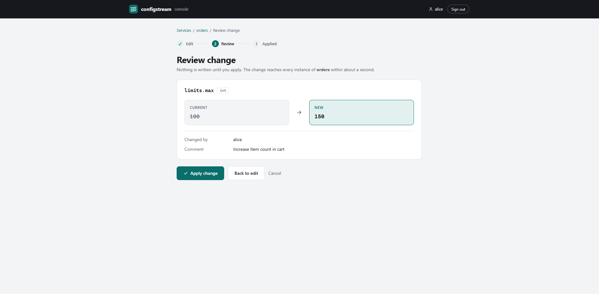
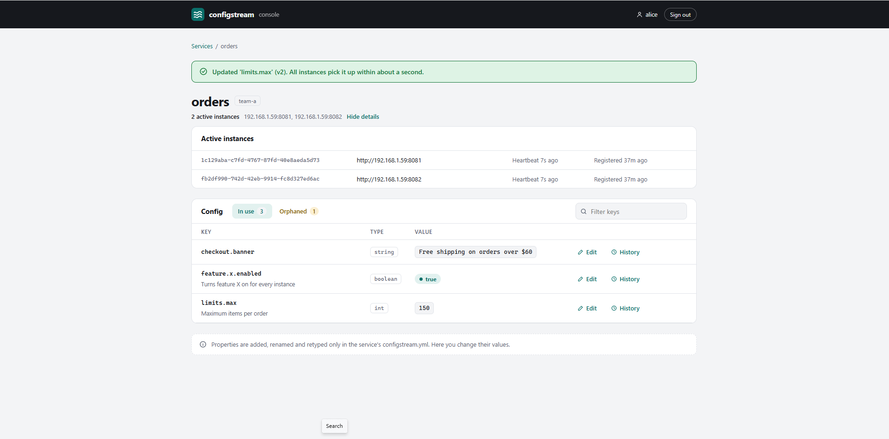
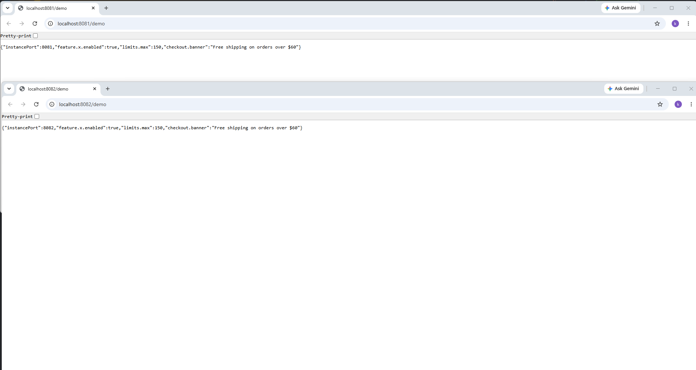
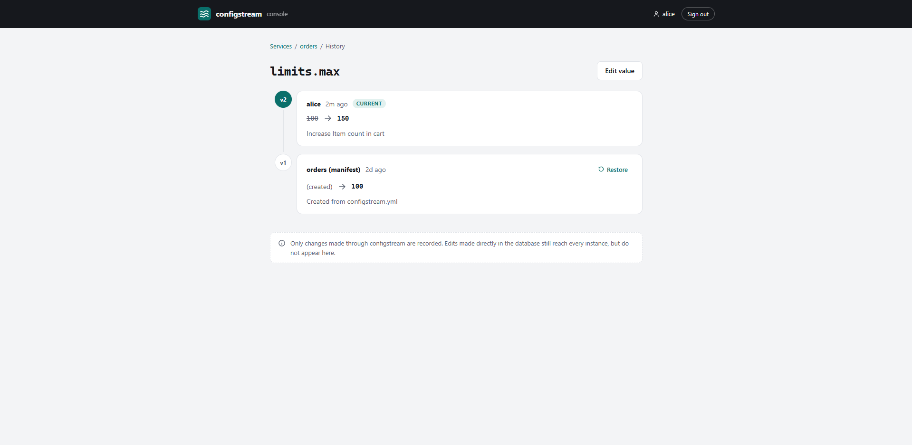

# Walkthrough: one change, end to end

An `orders` service runs as two instances, registered with the admin server. Its `configstream.yml` declares
`limits.max` (int, initially 100). It's Black Friday, and the limit must go up to 150 on every instance, without a
restart. These screenshots come from the [Docker quick start](../README.md#try-it-in-two-minutes), which signs in as
`alice`; without a login, the admin server warns that it's for trusted networks only, and asks for a name with each
change.

## 1. Edit, then review

On the **orders** page, **Edit** next to `limits.max`, enter 150 and a comment, then **Review**. Nothing is written
yet: the current and the new value are shown side by side, with who is changing it and why. The value is checked
against the property's type before this page appears.

## 2. Apply

**Apply change** sends the change to one instance, which writes it to MongoDB with its own credentials, together with
the history entry. The service page confirms version 2, lists both active instances with their heartbeats, and shows
every property with its type, value and description. The **Orphaned** tab lists stored properties that no running
instance declares anymore; only those can be deleted.

## 3. Every instance has the new value

MongoDB's change stream pushes the change to every instance, which updates its in-memory copy within about a second.
Both instances' `/demo` pages show `"limits.max":150`, with no restart and no refresh call.

## 4. History

**History** next to `limits.max` shows every change: v1 created from `configstream.yml`, v2 by alice with her comment.
**Restore** writes an old value back as a new version, so the history is never rewritten.

## How it works

The [architecture and low-level design](../README.md#how-it-works) diagrams in the README show the same flow: how a
value is read (from memory), changed (through one instance, in a transaction with its history) and pushed (change
stream).
